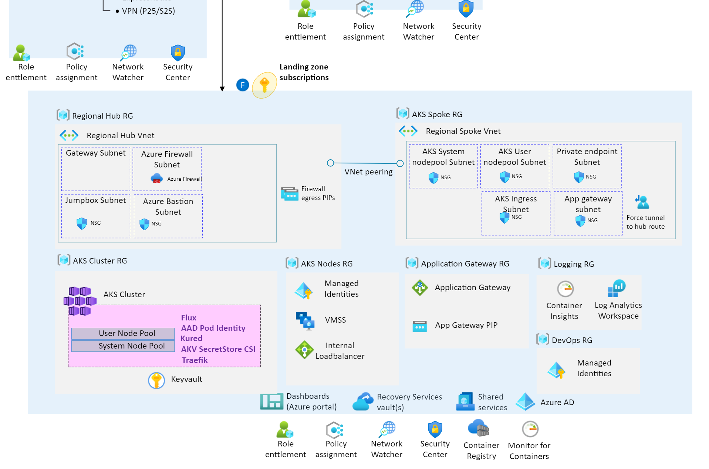

# Terraform

This folder contains the code to build the [AKS Baseline reference implementation](https://learn.microsoft.com/azure/architecture/reference-architectures/containers/aks/secure-baseline-aks) using [CAF Terraform Landing zone framework composition](https://github.com/aztfmod/terraform-azurerm-caf).

The following components will be deployed as part of this automation:

| Components                   | Config files                                                                                                                                                                                                                                                                                                                                                                                                                               | Description                                                                           |
| ---------------------------- | ------------------------------------------------------------------------------------------------------------------------------------------------------------------------------------------------------------------------------------------------------------------------------------------------------------------------------------------------------------------------------------------------------------------------------------------ | ------------------------------------------------------------------------------------- |
| Global Settings              | [global_settings.tfvars](./configuration/global_settings.tfvars)                                                                                                                                                                                                                                                                                                                                                                           | Primary Region setting. Changing this will redeploy the whole stack to another Region |
| Resource Groups              | [resource_groups.tfvars](./configuration/resource_groups.tfvars)                                                                                                                                                                                                                                                                                                                                                                           | Resource groups configs                                                               |
| Azure Kubernetes Service     | [aks.tfvars](./configuration/aks.tfvars)                                                                                                                                                                                                                                                                                                                                                                                                   | AKS addons, version, nodepool configs                                                 |
|                              | 
**Identity & Access Management**
                                                                                                                                                                                                                                                                                                                                                                                     |                                                                                       |
| Identity & Access Management | [iam_managed_identities.tfvars](./configuration/iam/iam_managed_identities.tfvars)   [iam_role_mappings.tfvars](./configuration/iam/iam_role_mappings.tfvars)                                                                                                                                                                                                                                                                         | AAD admin group, User Managed Identities & Role Assignments                           |
|                              | 
**Gateway**
                                                                                                                                                                                                                                                                                                                                                                                                          |                                                                                       |
| Application Gateway          | [agw.tfvars](./configuration/agw/agw.tfvars)   [agw_application.tfvars](./configuration/agw/agw_application.tfvars)   [waf_policies.tfvars](./configuration/agw/waf_policies.tfvars)                                                                                                                                                                                                                                        | Application Gateway WAF v2 Configs and Policies with aspnetapp workload settings      |
| App Service Domains          | [domain.tfvars](./configuration/agw/domain.tfvars)                                                                                                                                                                                                                                                                                                                                                                                         | Public domain to be used in Application Gateway                                       |
|                              | 
**Networking**
                                                                                                                                                                                                                                                                                                                                                                                                       |                                                                                       |
| Virtual networks             | [networking.tfvars](./configuration/networking/networking.tfvars)   [peerings.tfvars](./configuration/networking/peerings.tfvars)   [nsg.tfvars](./configuration/networking/nsg.tfvars)   [ip_groups.tfvars](./configuration/networking/ip_groups.tfvars)                                                                                                                                                                   | CIDRs, Subnets, NSGs & peerings config for Azure Firewall Hub & AKS Spoke             |
| Private DNS Zone             | [private_dns.tfvars](./configuration/networking/private_dns.tfvars)                                                                                                                                                                                                                                                                                                                                                                        | Private DNS zone for AKS ingress; A record to Load Balancer IP                        |
| Azure Firewall               | [firewalls.tfvars](./configuration/networking/firewalls.tfvars)   [firewall_application_rule_collection_definition.tfvars](./configuration/networking/firewall_application_rule_collection_definition.tfvars)   [firewall_network_rule_collection_definition.tfvars](./configuration/networking/firewall_network_rule_collection_definition.tfvars)   [route_tables.tfvars](./configuration/networking/route_tables.tfvars) | Azure Firewall for restricting AKS egress traffic                                     |
| Public IPs                   | [public_ips.tfvars](./configuration/networking/public_ips.tfvars)                                                                                                                                                                                                                                                                                                                                                                          | Public IPs for Application Gateway, Azure Firewall & Azure Bastion Host               |
|                              | 
**Security & Monitoring**
                                                                                                                                                                                                                                                                                                                                                                                            |                                                                                       |
| Azure Key Vault              | [keyvaults.tfvars](./configuration/keyvault/keyvaults.tfvars)   [certificate_requests.tfvars](./configuration/keyvault/certificate_requests.tfvars)                                                                                                                                                                                                                                                                                   | Key Vault to store Self signed certificate for AKS ingress & Bastion SSH key          |
| Azure Monitor                | [diagnostics.tfvars](./configuration/monitor/diagnostics.tfvars)    [log_analytics.tfvars](./configuration/monitor/log_analytics.tfvars)                                                                                                                                                                                                                                                                                              | Diagnostics settings, Log Analytics Workspace for AKS logs & Prometheus metrics       |
|                              | 
**Bastion**
                                                                                                                                                                                                                                                                                                                                                                                                          |                                                                                       |
| Azure Bastion (OPTIONAL)     | [bastion.tfvars](./configuration/bastion/bastion.ignore)                                                                                                                                                                                                                                                                                                                                                                                   | Azure Bastion Host & Windows VM to view aspnetsample website internally.              |

 

## Prerequisites

Make sure these [prerequisites](../IaC-prerequisites.md) are in place before proceeding.

## Customize the Terraform templates

To customize the sample terraform templates provided based on your specific needs, follow the steps below:

1. Fork this repo so that you can customize it and run GitHub action workflows.
2. Review the terraform templates provided under the IaC/terraform folder and customize these files based on your specific deployment requirements for each resource.
3. [Optional] Test the deployment of each Azure resource individually using these [manual](./terraform-manual-steps.md) commands.
4. Customize the GitHub repo settings for flux so that it picks up your customized yaml files when deploying the shared services for your cluster. You need to change these settings in the file [`flux.yaml`](../../IaC/terraform/configuration/workloads/flux.tfvars) to point to your forked GitHub repo.

## Customize the GitHub action workflows
To customize the sample GitHub pipeline provided based on your specific needs, follow the instructions below:

1. Create your workflow [GitHub Environment](https://docs.github.com/en/actions/deployment/targeting-different-environments/using-environments-for-deployment) to store the following secrets:

    | Secret                | Description                                                 | Sample |
    | --------------------- | ----------------------------------------------------------- | ------ |
    | AZURE_CLIENT_ID       | Service Principal which will be used to provision resources |        |
    | AZURE_CLIENT_SECRET   | Service Principal secret                                    |        |
    | AZURE_SUBSCRIPTION_ID | Azure subscription id                                       |        |
    | AZURE_TENANT_ID       | Azure tenant id                                             |        |

    > Note: Do not modify the names of these secrets in the workflow yaml file as they are expected in terraform to be named as shown above.
    Also instead of using a Service Principal and storing the secret in the GitHub Cloud, once AzureRM Provider is updated to 3.7.0+ you should setup [Workload Identity federation with OpenID Connect](https://learn.microsoft.com/azure/developer/github/connect-from-azure?tabs=azure-portal%2Cwindows#use-the-azure-login-action-with-openid-connect). Follow [these steps](../oidc-federated-credentials.md) to set it up with [Terraform Azure Provider Auth](https://registry.terraform.io/providers/hashicorp/azurerm/latest/docs/guides/service_principal_oidc).

2. Provide the workflow [IaC-terraform-AKS.yml](../../.github/workflows/IaC-terraform-AKS.yml) inputs during the workflow run:
   | Input                        | Description                                                                                                                       | Default value | Required           |
   | ---------------------------- | --------------------------------------------------------------------------------------------------------------------------------- | ------------- | ------------------ |
   | ENVIRONMENT                  | A GitHub Environment which must be selected to pull action secrets from                                                           |               | :white_check_mark: |
   | REGION                       | The Azure region to deploy to                                                                                                     | eastus        | ❌                  |
   | TF_BACKEND_STORAGE_ACCOUNT   | The Azure Storage Account where TF backend will be stored (must be unique). Skip this param if you want to use a TF local backend | ""            | ❌                  |
   | DEPLOY_PLAN_ONLY             | Execute Terraform plan only                                                                                                       | false         | ❌                  |
   | DEPLOY                       | Execute Terraform apply only                                                                                                      | true          | ❌                  |
   | DESTROY_PLAN_ONLY            | Execute Terraform plan -destroy only                                                                                              | false         | ❌                  |
   | DESTROY                      | Execute Terraform destroy                                                                                                         | false         | ❌                  |
   | clusterAdminAADGroupObjectId | K8S Admin Azure AAD Group ObjectID                                                                                                | ""            | ❌                  |
   | clusterUserAADGroupObjectId  | K8S User Azure AAD Group ObjectID                                                                                                 | ""            | ❌                  |
    > Note: This sample workflow file deploys Azure resources respectively in the hub and spoke resource groups as specified in the [AKS Baseline Reference Implementation](https://github.com/mspnp/aks-baseline).

## Kick-off the GitHub action workflow
As the workflow trigger is set to "workflow_dispatch", you can manually start it by clicking on [Actions](https://github.com/Azure/aks-baseline-automation/actions) in this repo, find the workflow [IaC-terraform-AKS.yml](../../.github/workflows/IaC-terraform-AKS.yml), and run it by clicking on the "Run Workflow" drop down.

As the workflow runs, monitor its logs for any error.
