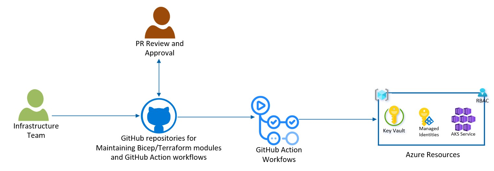
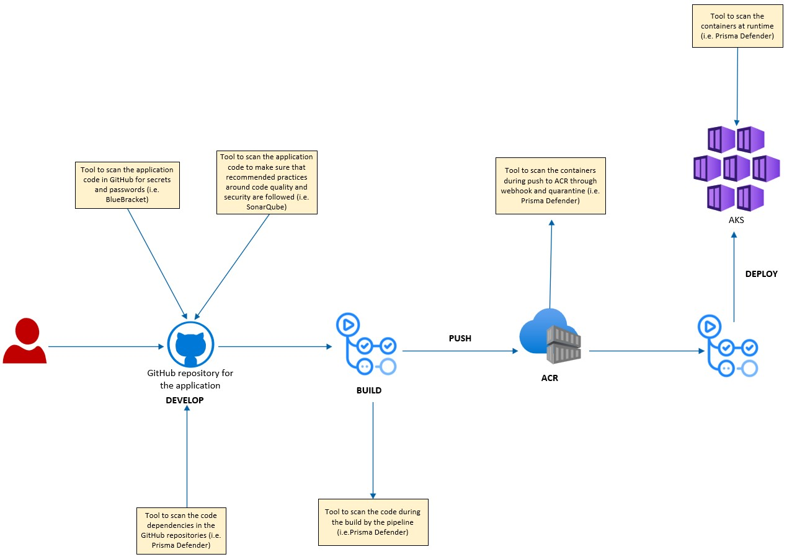
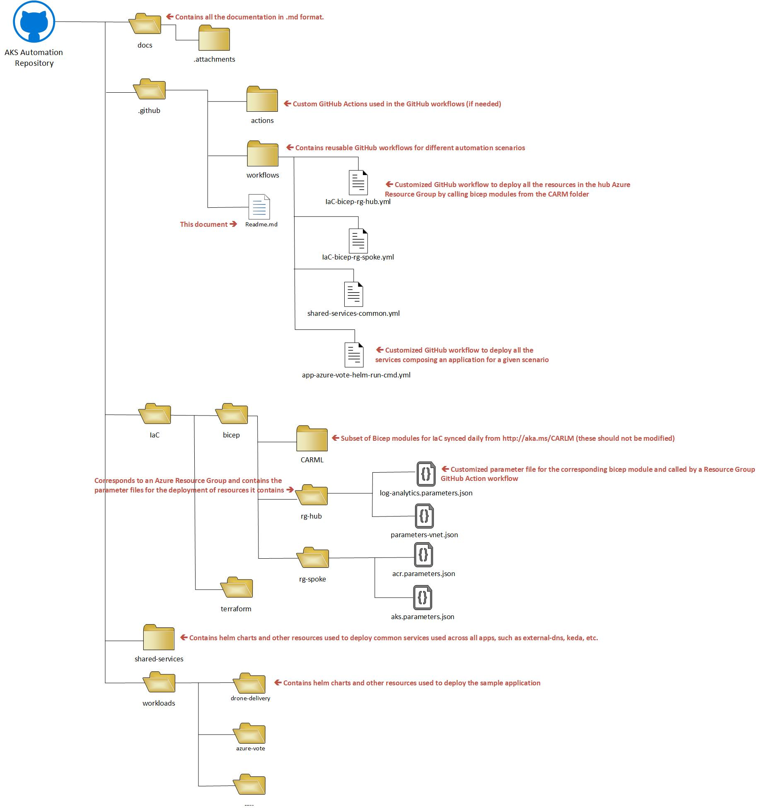

- [AKS Baseline Automation](#aks-baseline-automation)
  - [Infrastructure as Code](#infrastructure-as-code)
    - [Deploy AKS using GitHub Actions and Bicep](#deploy-aks-using-github-actions-and-bicep)
    - [Deploy AKS using GitHub Actions and Terraform](#deploy-aks-using-github-actions-and-terraform)
  - [Shared-Services](#shared-services)
  - [Application Deployment](#application-deployment)
  - [Lifecycle-Management](#lifecycle-management)
    - [Automate the lifecycle-management of the cluster using GitHub Actions](#automate-the-lifecycle-management-of-the-cluster-using-github-actions)
    - [Automate the lifecycle-management of the shared-services using GitHub Actions](#automate-the-lifecycle-management-of-the-shared-services-using-github-actions)
    - [Automate the lifecycle-management of the sample application using GitHub Actions](#automate-the-lifecycle-management-of-the-sample-application-using-github-actions)
  - [Secure DevOps](#secure-devops)
  - [GitHub Repo structure](#github-repo-structure)
  - [Contributing](#contributing)
  - [Trademarks](#trademarks)
# AKS Baseline Automation
 
This reference implementation demonstrates recommended ways to automate the deployment of the components composing a typical AKS solution.

This implementation and associated documentation are intended to inform the interdisciplinary teams involved in AKS deployment and lifecycle management automation. These teams include:
    
 * The **Infrastructure team** responsible for automating the deployment of AKS and the Azure resources that it depends on, such as ACR, KeyVault, Managed Identities, Log Analytics, etc. We will provide sample code to show you how to implement such automation using Infrastructure as Code (IaC). We will use a CI/CD Pipeline built using GitHub Actions and offer you the option to choose between Bicep or Terraform for the code to deploy the resources.
 * The **Networking team**, which the Infrastructure team has to coordinate their activities closely with and which is responsible for all the networking components of the solution such as Vnets, DNS, App Gateways, etc.  
 * The **Application teams** responsible for automating the deployment of their application services into AKS and managing their release to production using a Blue/Green or Canary approach. We will provide sample code and guidance for how these teams can accomplish their goals by packaging their service using helm and deploying them either through a CI/CD pipeline such as GitHub Actions or a GitOp tools such as Flux.
 * The **Shared-Services team** responsible for maintaining the overall health of the AKS clusters and the common components that run on them, such as monitoring, networking, security and other utility services.  We will provide sample code and guidance for how to bootstrap these services as part of the initial AKS deployment and also how to automate their on-going life-cycle management. These Shared-Services, may be AKS add-ons such as [AAD Pod identity](https://docs.microsoft.com/en-us/azure/aks/use-azure-ad-pod-identity) or [Secret Store CSI Driver Provider](https://github.com/Azure/secrets-store-csi-driver-provider-azure), 3rd party such as [Prisma defender](https://docs.paloaltonetworks.com/prisma/prisma-cloud) or [Splunk](https://github.com/splunk/splunk-connect-for-kubernetes) daemonset, or open source such as [KEDA](https://keda.sh), [External-dns](https://github.com/kubernetes-sigs/external-dns#:~:text=ExternalDNS%20supports%20multiple%20DNS%20providers%20which%20have%20been,and%20we%20have%20limited%20resources%20to%20test%20changes.) or [Cert-manager](https://cert-manager.io/docs/). This team is also responsible for the lifecycle management of the clusters, such as making sure that updates/upgrades are periodically performed on the cluster, its nodes, the Shared-Services running in it and that cluster configuration changes are seamlessly conducted as needed without impacting the applications. 
 * The **Security team** is responsible in making sure that security is built into the pipeline and all components deployed are secured by default. They will also be responsible for maintaining the Azure Policies, NSGs, firewalls rules outside the cluster as well as all security related configuration within the AKS cluster, such as Kubernetes Network Policies, RBAC or authentication and authorization rules within a Service Mesh. 

Each team will be responsible for maintaining their own automation pipeline. These pipelines access to Azure should only be granted through a Service Principal, a Managed Identity or preferrably a Federated Identity with the minimum set of permissions required to automatically perform the tasks that the team is responsible for.

## Infrastructure as Code   
This section demonstrates the implementation of a CI/CD pipeline built using GitHub Actions to automate the deployments of AKS and other Azure resources that AKS depends on. This pipeline deploys the [AKS Baseline Reference Implementation](https://github.com/mspnp/aks-baseline) using either Biceps or Terraform modules.

### Deploy AKS using GitHub Actions and Bicep
Under the IaC/bicep folder you will find the instructions and the code to deploy the [AKS Baseline Reference Implementation](https://github.com/mspnp/aks-baseline) through a GitHub Actions pipleine leveraging bicep [CARML](https://CARML) modules.

### Deploy AKS using GitHub Actions and Terraform
Under the IaC/terraform folder you will find the instructions and the code to deploy the [AKS Baseline Reference Implementation](https://github.com/mspnp/aks-baseline) through a GitHub Actions pipleine leveraging [CAF Terraform modules](https://github.com/Azure/caf-terraform-landingzones-starter/tree/starter/enterprise_scale/construction_sets/aks/online/aks_secure_baseline).

## Shared-Services
This section demonstrates the provisioning of the Shared-Services.  These services are the in-cluster common components that are used by all applications running on the cluster.
We also provide example of metrics of interest from these Shared-Services that can be captured and surfaced in a dashboard to help with their maintenance.

In this section we demonstrate two implementation options:
 * A GitOps solution using the AKS [Flux](https://fluxcd.io/) extension. 
 * **TODO:** A CI/CD pipeline built using GitHub Actions
  

The GitOps solution features: 
 * An opinionated [overlay structure](https://cloud.google.com/anthos-config-management/docs/how-to/use-repo-kustomize-helm) that shows separation of concern and asset structure/management of the components that are bootstrapping the cluster.
* Safe deployment practices with GitOps
* A Shared-Services own dedicated ACR instance (not shared with workload) for OCI artifacts (like helm charts)

Note: as this reference implementation and reference architecture launch, content from the [AKS Baseline (RA/RI)](https://github.com/mspnp/aks-baseline) around GitOps will be updated to point to this RA/RI to give the user a chance to do a deep dive. The AKS Baseline will keep using flux to bootstrap the cluster, but it won’t get into lifecycle management or opinionated kustomization folder structures, etc like this one will.

## Application Deployment   
This section demonstrates the deployment of an application composed of multiple services by leveraging two options:
 * A CI/CD pipeline built using Kubernetes GitHub Actions.
 * **TODO:** A GitOps solution using [ArgoCD](https://argoproj.github.io/cd/). Note that we could also have used [Flux](https://fluxcd.io/) for this purpose, but using ArgoCD will showcase how an app team may chose to use a seperate tool for their specific workload lifecycle concerns as opposed to using the same tool as what the cluster operators use for cluster management.
 
The application will be deployed using helm charts and both the Blue/Green and Canary release management strategies will be demonstrated. 

The application [Azure Voring App](https://github.com/Azure-Samples/azure-voting-app-redis/) is used for this deployment as this application is quite simple, but yet demonstrates how to deploy an application composed of multiple containers. In this case the application is composed of a web-front-end written in Python and a data backend running Redis.

## Lifecycle-Management   
Different components of an AKS solution are often owned by different teams and typically follow their own liefcycle management schedule and process, sometimes using different tools. In this section we will cover the following lifecycle management processes:

 * Cluster lifecycle-management, such as patching nodes, upgrading AKS, adding/removing nodepools, changing min/max nb of nodes, changing nodepool subnet size, changing nodepool VM SKU, changing max pods, label/taints on nodes, adding/removing pod identities, adding/removing RBAC permissions, etc…
 * Workload lifecycle-management, such as upgrading one of the services composing the application and releasing it to production using a Blue/Green or Canary approach. External dependencies that the application may have, such as an API Management solution, a Redis cache service or a database may have their own lifecycle-management process and operated by a seperate team.
 * Shared-Services lifecycle management, such as upgrading one of the Shared-Services container images to adress some vulnerabuilities or take advatange of some new features.

For better security and version control, all these lifecycle management processes need to be git driven so that any change to any component of the AKS solution is done through code from a Git Repository and goes through a review and approval process. For this reason, we will provide two options to automatically carry out these tasks:
 * A CI/CD pipeline built using GitHub Actions
 * A GitOps solution using flux or argoCD.
 
### Automate the lifecycle-management of the cluster using GitHub Actions
**TODO**: add the code and document the steps to automate the lifecycle-management of the cluster using GitHub Actions.
### Automate the lifecycle-management of the shared-services using GitHub Actions
**TODO**: add the code and document the steps to automate the lifecycle-management of the shared-services using GitHub Actions.
### Automate the lifecycle-management of the sample application using GitHub Actions
**TODO**: add the code and document the steps to automate the lifecycle-management of the shared-services using GitHub Actions.

## Secure DevOps
A typical DevOps process for deploying containers to AKS can be depicted by the diagram below:

 
The security team focus is to make sure that security is built into this automation pipeline and that security tasks are shifted to the left and automated as much as possible. They will need for example to work with the different automation teams to make sure that the following controls are in place within their pipelines:

In addition to this oversight role, they will also have to build and maintain their own pipeline to automate the management of security related resources outside the clusters (Azure policies, firewall rules, NSGs, Azure RBAC, etc) as well as inside the cluster (Network Security Policies, Service Mesh authentication and A.uthroization rules, Kubernetes RBAC, etc).

**TODO**: document how to incorporate security controls into the devOps pipleine.

## GitHub Repo structure

This repository is organized as follow:

## Contributing

This project welcomes contributions and suggestions.  Most contributions require you to agree to a
Contributor License Agreement (CLA) declaring that you have the right to, and actually do, grant us
the rights to use your contribution. For details, visit https://cla.opensource.microsoft.com.

When you submit a pull request, a CLA bot will automatically determine whether you need to provide
a CLA and decorate the PR appropriately (e.g., status check, comment). Simply follow the instructions
provided by the bot. You will only need to do this once across all repos using our CLA.

This project has adopted the [Microsoft Open Source Code of Conduct](https://opensource.microsoft.com/codeofconduct/).
For more information see the [Code of Conduct FAQ](https://opensource.microsoft.com/codeofconduct/faq/) or
contact [opencode@microsoft.com](mailto:opencode@microsoft.com) with any additional questions or comments.

## Trademarks

This project may contain trademarks or logos for projects, products, or services. Authorized use of Microsoft 
trademarks or logos is subject to and must follow 
[Microsoft's Trademark & Brand Guidelines](https://www.microsoft.com/en-us/legal/intellectualproperty/trademarks/usage/general).
Use of Microsoft trademarks or logos in modified versions of this project must not cause confusion or imply Microsoft sponsorship.
Any use of third-party trademarks or logos are subject to those third-party's policies.
