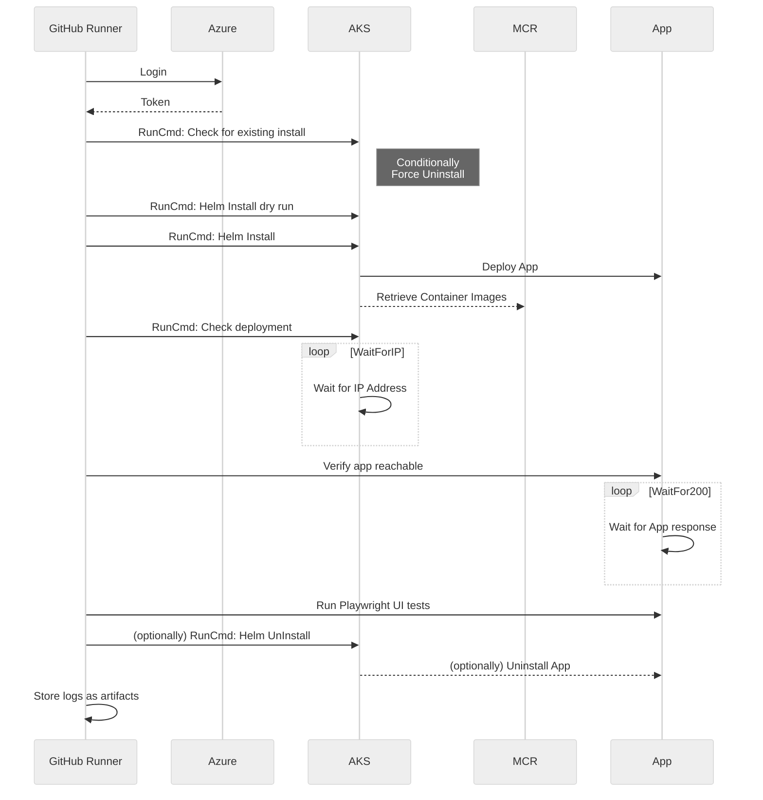

# Azure Vote - Helm Run Command Scenario

## Overview

This sample leverages the AKS Run Command and performs comprehensive validation steps to ensure the application has been deployed properly.



## Sample info

This sample is a GitHub Reusable Workflow, as an asset in a public repository it can be targetted directly or simply copied into your own repo.

Location of the [Reusable workflow file](.github/workflows/App-AzureVote-HelmRunCmd.yml)

```yaml
  #Here's how to call the reusable workflow from your workflow
  deploy-azure-vote-app:
    uses: Azure/aks-baseline-automation/.github/workflows/App-AzureVote-HelmRunCmd.yml@main
    with:
      RG: ResourceGroupToDeployTo
      AKSNAME: MyAksCluster
      APPNAME: azure-vote-public
      INGRESSTYPE: "PublicLoadBalancer"
    secrets:
      AZURE_CREDENTIALS: ${{ secrets.AZURE_CREDENTIALS }}
```

> This sample is directly leveraged in the [AKS Bicep Accelerator](https://github.com/Azure/Aks-Construction) for smoke-testing new Kubernetes clusters.

## Scenario Components

## Aks Voting App

The Aks Voting app is the application used in most Aks Getting Started guides. It is a 2 container application that allows the user to vote between Cats/Dogs.

## Helm

The Helm chart is written using subcharts for the pod deployments, whilst the parent Helm chart creates the Ingress and NetworkPolicy.

[Helm Docs](https://helm.sh/)
[Azure Vote Helm Chart](https://github.com/Gordonby/minihelm/tree/main/samples/azurevote)

## Aks Run Command

The Aks Run Command is allows you to remotely invoke commands in an AKS cluster through the Aks API. This can greatly assist with access to a private cluster when the client is not on the cluster private network while still retaining and enforcing full RBAC controls and private API server.

## Key Steps in the Action Workflow

### Verifying

After creating the application, it can be useful to check that the application is serving content.

### Playwright

Playwright is a web testing framework, it can be used to interact with a web application to mimic user input and verify that communication between pods is successful.

[Playwright](https://playwright.dev)
[Playwright web test](deploymentassets/misc/playwrighttests/azure-vote-catswin.spec.js)
