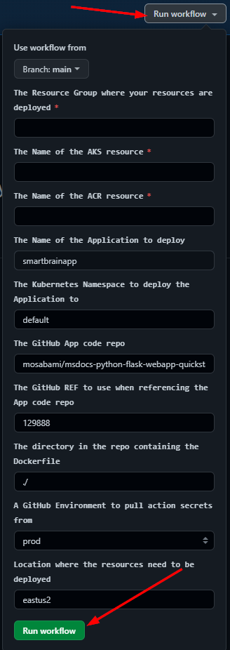
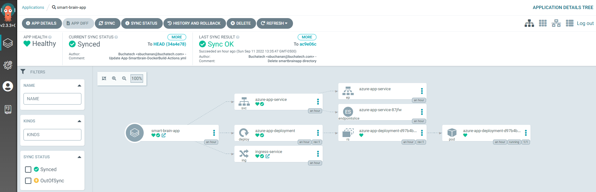

**Overview**

In the [**Automated build & deployment of container applications using DevOps & GitOps**](http://TBDlink.com/) document we explored the options of push and pull based CI/CD options along with the pros and cons of each. In this section we are going to explore the architecture of each option as well as the steps of the data flow in each option for a deeper understanding of how they work.

**Option \#1 Push-based CI/CD Architecture and Dataflow**

Figure 1 - Option \#1 Push based Architecture with GitHub Actions for CI and CD

This scenario covers a push-based DevOps pipeline for a 2-tier web application with a front-end web component and a back-end Redis. This pipeline uses GitHub Actions for build push and deployment. The data flows through the scenario as follows:

1.  The Smart Brain App code is developed.
2.  The Smart Brain App code is committed to the GitHub git repository.
3.  GitHub Actions Builds a container image from the Smart Brain App code and pushes the container image to Azure Container Registry.
4.  A GitHub Actions job deploys (pushes) the Smart Brain App to the AKS cluster via kubectl deployment of the Smart Brain App Kubernetes manifest files.

**Option \#2 Pull-based CI/CD Architecture and Dataflow**

Figure 2 - Option \#2 Pull based Architecture with GitHub Actions for CI and Argo CD for CD

This scenario covers a pull-based DevOps pipeline for a 2-tier web application with a front-end web component and a back-end Redis. This pipeline uses GitHub Actions for build and push it uses Argo CD a GitOps operator pull/sync for deployment. The data flows through the scenario as follows:

1.  The Smart Brain App code is developed.
2.  The Smart Brain App code is committed to the GitHub git repository.
3.  GitHub Actions Builds a container image from the Smart Brain App code and pushes the container image to Azure Container Registry.
4.  GitHub Actions logs into the AKS cluster and creates a secret for connecting to ACR used by the image deployment.
5.  GitHub Actions Updates a Kubernetes Manifest Deployment file with the current image version based on the version number of the container image in the Azure Container Registry and updates the manifest with the Kubernetes Secret name used to pull the container image from the Azure Container Registry.
6.  The GitOps Operator Argo CD syncs / pulls with the Git repository.
7.  The GitOps Operator Argo CD deploys the Smart Brain App to the AKS cluster.

**Scenario Components**

-   [GitHub](https://jenkins.io/) Actions is an automation solution that can integrate with Azure services to enable continuous integration (CI). In this scenario, GitHub Actions orchestrates the creation of new container images based on commits to source control, pushes those images to Azure Container Registry, then updates the Kubernetes manifest files in the GitHub repository.
-   [Azure Container Registry](https://docs.microsoft.com/en-us/azure/container-registry/container-registry-intro) stores and manages container images that are used by the Azure Kubernetes Service cluster. Images are securely stored, and can be replicated to other regions by the Azure platform to speed up deployment times.
-   [GitHub](https://docs.microsoft.com/en-us/azure/container-registry/container-registry-intro) is a web-based source control system that runs on Git used by developers to store and version their application code. In this scenario GitHub is used to store the source code in a Git repository and GitHub Actions is used to perform build and push of the container image to ACR and continuous deployment in the push-based approach.
-   Argo CD is an open source GitOps operator that integrates with GitHub and Azure Kubernetes Service. Argo CD enables and continuous deployment (CD). In this scenario we could have used Flux for this purpose, but using Argo CD will showcase how an app team may choose to use a separate tool for their specific application lifecycle concerns as opposed to using the same tool as what the cluster operators use for cluster management.
-   [Azure Kubernetes Service](https://docs.microsoft.com/en-us/azure/aks/intro-kubernetes) is a managed Kubernetes platform that lets you deploy and manage containerized applications without container orchestration expertise. As a hosted Kubernetes service, Azure handles critical tasks like health monitoring and maintenance for you.
-   [Azure Monitor](https://docs.microsoft.com/en-us/azure/monitoring-and-diagnostics/monitoring-overview) helps you track performance, maintain security, and identify trends. Metrics obtained by Monitor can be used by other resources and tools, such as Grafana.

**Deploy this scenario**

Before deploying the push or pull based end to end scenario you need to ensure you have met the prerequisites for this scenario. These prerequisites are listed in this section:

**Prerequisites for these scenarios**

-   You must have an existing Azure account. If you don't have an Azure subscription, create a [free account](https://azure.microsoft.com/free/?WT.mc_id=A261C142F) before you begin.
-   An ACR instance deployed
-   An AKS cluster
    -   It is highly recommended to utilize the [AKS Construction helper](https://azure.github.io/AKS-Construction/) to deploy your Azure Container Registry (ACR) and Azure Kubernetes Service (AKS) cluster. You can use this pre-configured link: [AKS Construction helper (pre-configured)](https://azure.github.io/AKS-Construction/?ops=managed&cluster.apisecurity=none&addons.ingress=none&addons.monitor=aci&addons.azurepolicy=none&addons.networkPolicy=none&addons.csisecret=none&deploy.location=EastUS2) to create a basic AKS cluster (not recommended for production) to use with this CI/CD scenario. This will create an ACR, and an AKS cluster that is AAD integrated and attached to the ACR
-   Argo CD installed on your AKS cluster ([Get Started with Argo CD](https://argo-cd.readthedocs.io/en/stable/getting_started/))
-   A GitHub account ([Getting started with your GitHub account](https://docs.github.com/en/get-started/onboarding/getting-started-with-your-github-account))
-   Fork the [AKS Baseline Automation repository](https://github.com/ibersanoMS/aks-baseline-automation)

**Scenario Walk-throughs**

#### Option \#1 Push-based CI/CD

To deploy the **Option \#1 Push-based CI/CD Architecture** scenario, perform the following steps:

*\#Step 1 - Fork this repo to your GitHub:*

<https://github.com/Azure/aks-baseline-automation>

Note: Be sure to uncheck "Copy the main branch only"

*\#Step 2 - Go to Actions on the forked repo and enable Workflows as shown*

<https://github.com/YOURUSERNAME/aks-baseline-automation/actions>

*\#Step 3 - Go to Settings on the forked repo and create a new environment*

add a new environment here

<https://github.com/YOURREPO/settings/environments/new>

Click New Environment button

Environments / Add

Name it prod

*\#Step 4 - Set Azure subscription*

In Azure cloud shell run

az account show *\#Shows current subscription*

az account set --subscription "YOURAZURESUBSCRIPTION" *\#Set a subscription to be the current active subscription*

\#Step 5 - *Run Authentication from GitHub to Azure Script*

<https://github.com/Azure/aks-baseline-automation/blob/application-gitops/docs/oidc-federated-credentials.md>

You will need to update the following variable values:

*\#Set up user specific variables*

APPNAME=myApp

RG=myAksClusterResourceGroup

GHORG=YOURGITHUBORGNAME

GHREPO=aks-baseline-automation

GHBRANCH=main

GHENV=prod

Upload the script to your Cloud shell and run:

bash ghtoAzAuth.sh

It will create the federated credentials *in* Azure *for* you. Navigate to Azure Portal \> Microsoft \| Overview

Azure Active Directory \> App registrations \> YOURREGISTEREDAPPNAME \| Certificates & secrets

You should have the following 3 Federated credentials similar to what is shown *in* the following screenshot:

Next you need to create the Environment and GitHub Actions Repository secrets *in* your repo.

*\#Step 6 - Create Actions secrets for your Azure subscription in your GitHub Repository*

*\#Reference:* [*https://docs.microsoft.com/en-us/azure/developer/github/connect-from-azure?tabs=azure-portal%2Clinux\#use-the-azure-login-action-with-a-service-principal-secret*](https://docs.microsoft.com/en-us/azure/developer/github/connect-from-azure?tabs=azure-portal%2Clinux#use-the-azure-login-action-with-a-service-principal-secret)

GitHub Actions Secrets:

<https://github.com/YOURREPONAME/YOURAPPNAME/settings/secrets/actions>

Environment Secrets:

<https://github.com/YOURREPONAME/YOURAPPNAME/settings/environments>

Select Secrets and *then* New Secret.

Click Add secret

*\#The values should be in the following format shown in these examples:*

AZURE_CLIENT_ID

hgce4f22-5ca0-873c-54ac-b451d7f73e622

AZURE_TENANT_ID

43f977bf-83f1-41zs-91cg-2d3cd022ty43

AZURE_SUBSCRIPTION_ID

C25c2f54-gg5a-567e-be90-11f5ca072277

When *done* you should see the following secrets *in* your GitHub Settings:

\#Step 7 - Run the GitHub Actions workflow

Go to [https://github.com/YOUR REPO/aks-baseline-automation/actions](https://github.com/YOUR%20REPO/aks-baseline-automation/actions)

Run the .github/workflows/App-Smartbrain-DockerBuild-Actions.yml workflow

Enter the needed inputs:

You will see the workflows start.

When it completes both jobs will green showing the workflow was successful.

You will be able to see the Azure Smart Brain App was successfully deployed to the default namespace in your AKS cluster as shown in the following screenshots:

#### Option \#2 Pull-based CI/CD(GitOps)

To deploy the **Option \#2 Pull-based CI/CD Architecture** scenario, perform the following steps:

*\#Step 1 - Fork this repo to your GitHub:*

https://github.com/Azure/aks-baseline-automation

Note: Be sure to uncheck "Copy the main branch only"

*\#Step 2 - Go to Actions on the forked repo and enable Workflows*

https://github.com/YOURUSERNAME/aks-baseline-automation/actions

*\#Step 3 - Go to Settings on the forked repo and create a new environment*

add a new environment here

https://github.com/YOUR REPO/settings/environments/new

Click New Environment button

Environments / Add

Name it prod

*\#Step 4 - Set Azure subscription*

In Azure cloud shell run

az account show *\#Shows current subscription*

az account set --subscription "YOURAZURESUBSCRIPTION" *\#Set a subscription to be the current active subscription*

*\#Step 5 - Run Authentication from GitHub to Azure Script*

https://github.com/Azure/aks-baseline-automation/blob/application-gitops/docs/oidc-federated-credentials.md

You will need to update the following variable values:

*\#Set up user specific variables*

APPNAME=myApp

RG=myAksClusterResourceGroup

GHORG=YOURGITHUBORGNAME

GHREPO=aks-baseline-automation

GHBRANCH=main

GHENV=prod

Upload the script to your Cloud shell and run:

bash ghtoAzAuth.sh

It will create the federated credentials *in* Azure *for* you. Navigate to Azure Portal \> Microsoft \| Overview

Azure Active Directory \> App registrations \> YOURREGISTEREDAPPNAME \| Certificates & secrets

You should have the following 3 Federated credentials similar to what is shown *in* the following screenshot:

Next you need to create the Environment and GitHub Actions Repository secrets *in* your repo.

*\#Step 6 - Create Actions secrets for your Azure subscription in your GitHub Repository*

*\#Reference:* [*https://docs.microsoft.com/en-us/azure/developer/github/connect-from-azure?tabs=azure-portal%2Clinux\#use-the-azure-login-action-with-a-service-principal-secret*](https://docs.microsoft.com/en-us/azure/developer/github/connect-from-azure?tabs=azure-portal%2Clinux#use-the-azure-login-action-with-a-service-principal-secret)

Github Actions Secrets:

<https://github.com/YOURREPONAME/YOURAPPNAME/settings/secrets/actions>

Environment Secrets:

<https://github.com/YOURREPONAME/YOURAPPNAME/settings/environments>

Select Secrets and *then* New Secret.

Click Add secret

*\#The values should be in the following format shown in these examples:*

AZURE_CLIENT_ID

hgce4f22-5ca0-873c-54ac-b451d7f73e622

AZURE_TENANT_ID

43f977bf-83f1-41zs-91cg-2d3cd022ty43

AZURE_SUBSCRIPTION_ID

C25c2f54-gg5a-567e-be90-11f5ca072277

When *done* you should see the following secrets *in* your GitHub Settings:

*\#Step 7 - Run the GitHub Actions workflow*

Go to your GitHub Actions here https://github.com/YOURREPONAME/aks-baseline-automation/actions/workflows/

Click “I understand my workflows, go ahead and enable them” to show all of the forked GitHub Actions workflows.

Next run the following workflow:

.github/workflows/GitOps-Deploy-Smartbrain.yml

When you run the GitHub Actions workflow you will be prompted *for* your inputs as shown *in* the following screenshot:

*\#Step 8 - Create a new app for the Azure Smart Brain App in Argo CD*

See this link on how to create a new app in Argo CD:

https://argo-cd.readthedocs.io/en/stable/getting_started/\\\#creating-apps-via-ui

This is an example of a successful Azure Smart Brain App in Argo CD:

