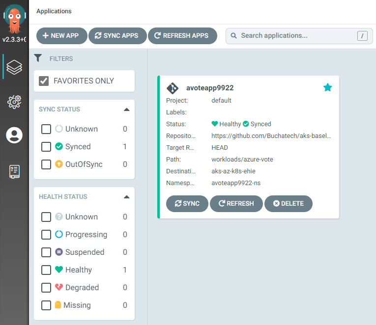

## Option \#2 Pull-based CI/CD(GitOps)

This article outlines deploying with the pull option as describled in the [automated build and deploy for container applications article](../app-automated-build-devops-gitops.md). To deploy the **Option \#2 Pull-based CI/CD Architecture** scenario, follow the steps outlined there (if you haven't already), then perform the following steps:

*\#Step 1 - Fork this repo to your GitHub:*

https://github.com/Azure/aks-baseline-automation

Note: Be sure to uncheck "Copy the main branch only"

*\#Step 2 - Go to Actions on the forked repo and enable Workflows as shown*

<https://github.com/YOURUSERNAME/aks-baseline-automation/actions>

*\#Step 3 - Go to Settings on the forked repo and create a new environment*

add a new environment here

https://github.com/YOUR REPO/settings/environments/new

Click New Environment button

Environments / Add

Name it prod

*\#Step 4 - Set Azure subscription*

In Azure cloud shell run

az account show *\#Shows current subscription*

az account set --subscription "YOURAZURESUBSCRIPTION" *\#Set a subscription to be the current active subscription*

*\#Step 5 - Run Authentication from GitHub to Azure Script*

https://github.com/Azure/aks-baseline-automation/blob/application-gitops/docs/oidc-federated-credentials.md

You will need to update the following variable values:

*\#Set up user specific variables*

APPNAME=myApp

RG=myAksClusterResourceGroup

GHORG=YOURGITHUBORGNAME

GHREPO=aks-baseline-automation

GHBRANCH=main

GHENV=prod

Upload the script to your Cloud shell and run:

bash ghtoAzAuth.sh

It will create the federated credentials *in* Azure *for* you. Navigate to Azure Portal \> Microsoft \| Overview

Azure Active Directory \> App registrations \> YOURREGISTEREDAPPNAME \| Certificates & secrets

You should have the following 3 Federated credentials similar to what is shown *in* the following screenshot:

Next you need to create the Environment and GitHub Actions Repository secrets *in* your repo.

*\#Step 6 - Create Actions secrets for your Azure subscription in your GitHub Repository*

*\#Reference: https://docs.microsoft.com/en-us/azure/developer/github/connect-from-azure?tabs=azure-portal%2Clinux\#use-the-azure-login-action-with-a-service-principal-secret*

Github Actions Secrets:

https://github.com/YOURREPONAME/YOURAPPNAME/settings/secrets/actions

Select Secrets and *then* New Secret named AZURE_CREDENTIALS.

Paste *in* your JSON object *for* your service principal with the name AZURE_CREDENTIALS

Click Add secret

Environment Secrets:

<https://github.com/YOURREPONAME/YOURAPPNAME/settings/environments>

*\#The values should be in the following format shown in these examples:*

AZURE_CLIENT_ID

hgce4f22-5ca0-873c-54ac-b451d7f73e622

AZURE_TENANT_ID

43f977bf-83f1-41zs-91cg-2d3cd022ty43

AZURE_SUBSCRIPTION_ID

C25c2f54-gg5a-567e-be90-11f5ca072277

When *done* you should see the following secrets *in* your GitHub Settings:

*\#Step 7 - Run the GitHub Actions workflow*

Go to your GitHub Actions here https://github.com/YOURREPONAME/aks-baseline-automation/actions/workflows/

Next run the following workflow:

.github/workflows/GitOps-Deploy-All.yml

When you run the GitHub Actions workflow you will be prompted *for* your inputs as shown *in* the following screenshot:

*\#Step 8 - Create a new app for the Azure Voting App in Argo CD*

See this link on how to create a new app in Argo CD:

[https://argo-cd.readthedocs.io/en/stable/getting_started/\\\#creating-apps-via-ui](https://argo-cd.readthedocs.io/en/stable/getting_started/\#creating-apps-via-ui)

This is an example of a successful Azure Voting App in Argo CD:

