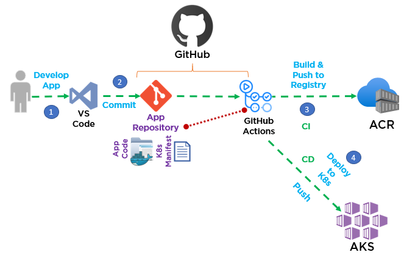
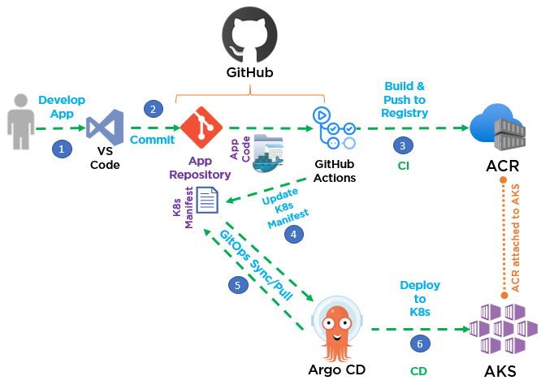

# Overview

In the [**Automated build & deployment of container applications using DevOps & GitOps**](http://TBDlink.com/) document we explored the options of push and pull based CI/CD options along with the pros and cons of each. In this section we are going deploy a scenario that explains these two options further. To explore the architecture in more detail, please check out the [reference architecture in Microsoft Docs](http://TBDlink.com/)

### Option \#1 Push-based CI/CD Architecture and Dataflow

This scenario covers a push-based DevOps pipeline for a web application with a front-end component. This pipeline uses GitHub Actions for build push and deployment. The data flows through the scenario as follows:

1.  The App code is developed.
1.  The App code is committed to the GitHub git repository.
1.  GitHub Actions Builds a container image from the App code and pushes the container image to Azure Container Registry.
1.  A GitHub Actions job deploys (pushes) the App to the AKS cluster via kubectl deployment of the App Kubernetes manifest files.

### Option \#2 Pull-based CI/CD Architecture and Dataflow

This scenario covers a pull-based DevOps pipeline for a web application with a front-end component. This pipeline uses GitHub Actions for build and push it uses Argo CD a GitOps operator pull/sync for deployment. The data flows through the scenario as follows:

1.  The App code is developed.
1.  The App code is committed to the GitHub git repository.
1.  GitHub Actions Builds a container image from the App code and pushes the container image to Azure Container Registry.
1.  GitHub Actions Updates a Kubernetes Manifest Deployment file with the current image version based on the version number of the container image in the Azure Container Registry.
1.  The GitOps Operator Argo CD syncs / pulls with the Git repository.
1.  The GitOps Operator Argo CD deploys the app to the AKS cluster.

## Deploy this scenario

Before deploying the push or pull based end to end scenario you need to ensure you have met the prerequisites for this scenario. These prerequisites are listed in this section:

### Prerequisites for these scenarios

-   You must have an existing Azure account. If you don't have an Azure subscription, create a [free account](https://azure.microsoft.com/free/?WT.mc_id=A261C142F) before you begin.
-   An ACR instance deployed
-   An AKS cluster. It is highly recommended that you utilize one of the two options below:
    - **Quick option**: The [AKS Construction helper](https://azure.github.io/AKS-Construction/) to deploy your Azure Container Registry (ACR) and Azure Kubernetes Service (AKS) cluster. You can use this pre-configured link: [AKS Construction helper (pre-configured)](https://azure.github.io/AKS-Construction/?ops=managed&cluster.apisecurity=none&addons.ingress=appgw&addons.monitor=aci&addons.azurepolicy=none&addons.networkPolicy=none&addons.csisecret=akvNew&deploy.location=EastUS2&addons.appgwKVIntegration=false) to create an AKS cluster to use with this CI/CD scenario. This will create an ACR (container registry), Azure Key vault, Application gateway, an AKS cluster that is AAD integrated and other required Azure resources.
    - The **[IaC workflows](../../IaC/README.md)** used in this repo, which walks you through the process of managing your infrastructure using automation with bicep or terraform.
-   Argo CD installed on your AKS cluster (only required for pull option) ([Get Started with Argo CD](https://argo-cd.readthedocs.io/en/stable/getting_started/))
-   A GitHub account ([Getting started with your GitHub account](https://docs.github.com/en/get-started/onboarding/getting-started-with-your-github-account))
-   Fork the [AKS Baseline Automation repository](https://github.com/azure/aks-baseline-automation)

### Next
Pick one of the following options to deploy a workload using automation

:arrow_forward: [Push option](./app-flask-push-dockerbuild.md)

:arrow_forward: [Pull option](./app-flask-pull-gitops.md)

:arrow_forward: [Other app scenarios](./other-app-scenarios)
