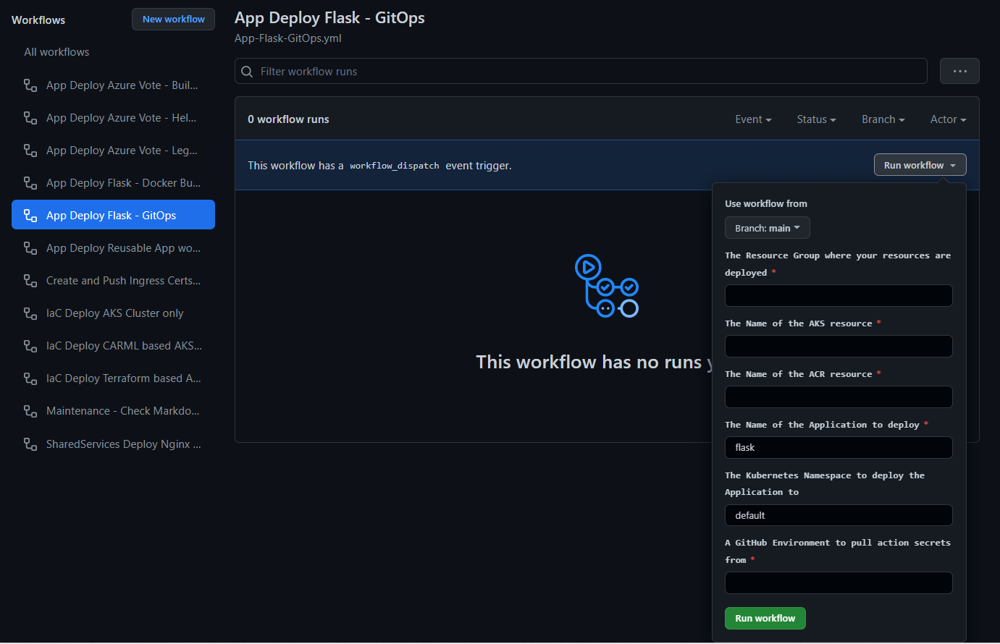
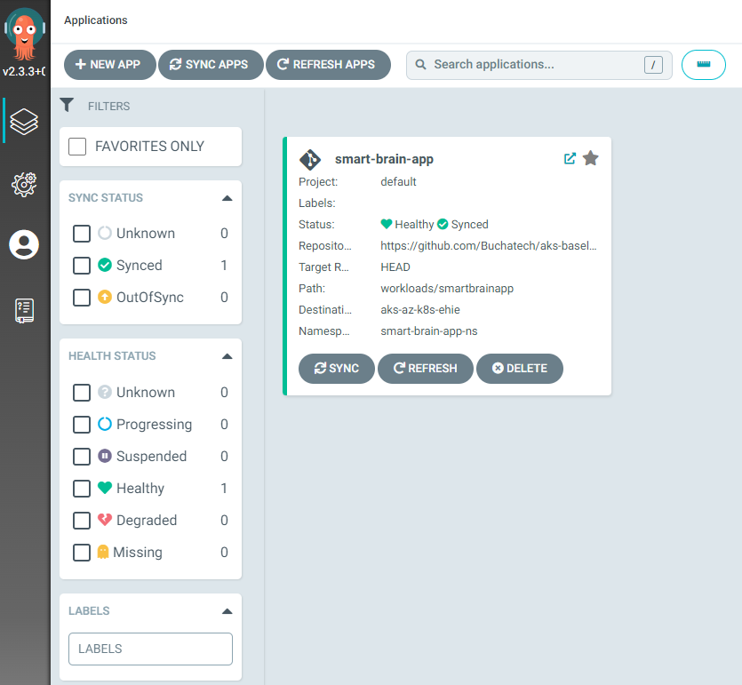
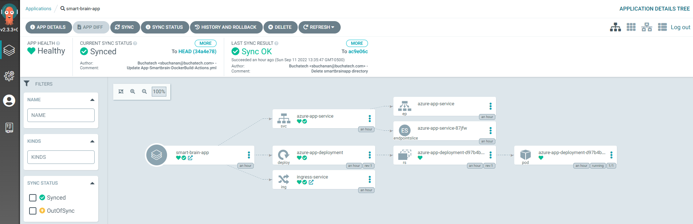

## Option \#2 Pull-based CI/CD(GitOps)

This article outlines how to deploy your workload using the pull option as described in the [CI/CD pipeline for container-based workloads](https://learn.microsoft.com/azure/architecture/example-scenario/apps/devops-with-aks) article. To deploy this scenario, follow the prerequisites steps outlined [here](README.md) (if you haven't already), then perform the following steps:

1. Follow steps 1 to 5 in [Option #1 Push-based CI/CD](./app-flask-push-dockerbuild.md) to setup your GitHub environment.
2. Install Argo CD on your AKS cluster by following the steps in [Get Started with Argo CD](https://argo-cd.readthedocs.io/en/stable/getting_started/).
   
3. Run the [.github/workflows/App-Flask-GitOps.yml](../../.github/workflows/App-Flask-GitOps.yml) workflow by clicking on **Actions** and selecting the display name for this workflow, which is **App Deploy Flask - GitOps**. This workflow will build and push the container image to the Azure Container Registry (ACR), then it will update the application *deployment.yaml* file with the names of the pushed image. 
   
    Enter the parameters requested by this workflow as shown below:
       
4. Create a new app for the App in Argo CD by following [these steps](https://argo-cd.readthedocs.io/en/stable/getting_started/#creating-apps-via-ui). Make sure you enter the following parameters:
   - Application Name: flask
   - Project Name: default
   - Sync Policy: Automatic
   - Source
     - Repository URL: https://github.com/YOURREPO/aks-baseline-automation.git
     - Revision: HEAD
     - Path: workloads/flask
   - Destination:
     - Cluster URL: https://kubernetes.default.svc
     - Namespace: default

    After the app is created, click on the **SYNC** button in the Argo CD portal to deploy it.

    This is an example of the successful App in Argo CD:

5. Check the deployment from the Azure portal as in [Option #1 Push-based CI/CD](./app-flask-push-dockerbuild.md) to make sure that the application was successfully deployed. Also test that you can access it. 
