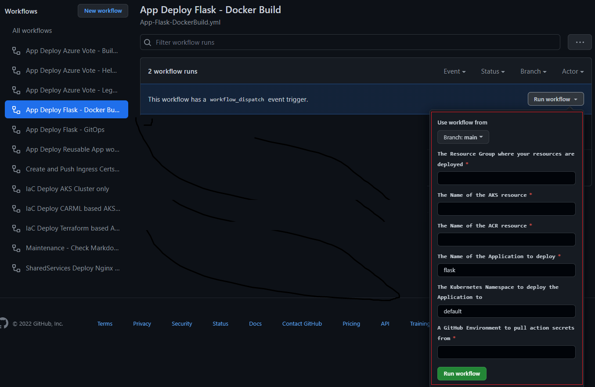

## Option \#1 Push-based CI/CD

This article outlines how to deploy your workload using the push option as described in the [CI/CD pipeline for container-based workloads](https://learn.microsoft.com/azure/architecture/example-scenario/apps/devops-with-aks) article. To deploy this scenario, follow the prerequisites steps outlined [here](README.md) (if you haven't already), then perform the following steps:

1. Go to Actions on the forked repo and enable Workflows as shown: <https://github.com/YOURUSERNAME/aks-baseline-automation/actions>
   
2. Go to **Settings** on the forked repo and create a new environment
    1. You can access the page directly from here: https://github.com/YOUR-REPO/settings/environments/new
    2. Click the **New environment** button
    3. Name it "prod"
3. Set Azure subscription
    1. In Azure cloud shell run
       ```bash
       az account show  # Show current subscription

       az account set --subscription "YOURAZURESUBSCRIPTION" *\#Set a subscription to be the current active subscription*
       ```
    2. Create a file called `ghToAzAuth.sh` in your bash working directory and copy the code block in [this .md file](https://github.com/Azure/aks-baseline-automation/blob/main/IaC/oidc-federated-credentials.md) into it. You will need to update the following variable values:
       ```bash
       APPNAME=myApp
       RG=<AKS resource group name>
       GHORG=<your github org or user name>
       GHREPO=aks-baseline-automation
       GHBRANCH=main
       GHENV=prod
       ```
    3. Save the shell script after you have made the updates to those variables and run the script in your cloud shell
       ```bash
       bash ghToAzAuth.sh
       ```
       This script will create the federated credentials in Azure AD for you. Navigate to **Azure Portal \>  Azure Active Directory \> App registrations \> YOURREGISTEREDAPPNAME \| Certificates & secrets**.
       You should see the following 3 Federated credentials similar to what is shown *in* the following screenshot:
       
       Next you need to create the Environment and GitHub Actions Repository secrets *in* your repo.
4. Add Actions secrets for the "Prod" Environment you created previously per [these instructions](https://learn.microsoft.com/en-us/azure/developer/github/connect-from-azure?tabs=azure-portal%2Clinux#create-github-secrets):
    1. Navigate to Github Actions Secrets: from your repo select **Settings > Environments > Prod**.
    2. Click **Add secret** and create the following 3 secrets:
       ```bash
       # The values should be in the following format shown in these examples.
       # Make sure you replace these values with the ones from your own environment
        AZURE_CLIENT_ID = 1gce4f22-5ca0-873c-54ac-b451d7f73e622
        AZURE_TENANT_ID: 43f977bf-83f1-41zs-91cg-2d3cd022ty43
        AZURE_SUBSCRIPTION_ID: C25c2f54-gg5a-567e-be90-11f5ca072277
       ```
       
    3. When *done* you should see the following secrets *in* your GitHub Settings:
       
5. Customize the deployment files (if needed)
   
   If you are using the IaC option, you will need to update the *workloads/flask/ingress.yaml* file to use the traefik ingress option by commenting out the *Http agic* ingress and uncommenting the *Https traefik* ingress. You will also need to update the fqdn in Https traefik to match the configuration you have in your Application gateway. For the quick option with AKS Construction helper, no change is required.
6. Run the [.github/workflows/App-flask-DockerBuild-Actions.yml](../../.github/workflows/App-Flask-DockerBuild.yml) workflow by clicking on **Actions** and selecting the display name for this workflow, which is **App Deploy Flask - Docker Build**.
    1. Enter the needed inputs:
       
    2. You will see the workflows start.
       
    3. When it completes both jobs will green showing the workflow was successful.
       
    4. You will be able to see the App was successfully deployed to the default namespace in your AKS cluster as shown in the following screenshots:
       
       
7. Test the workflow
   1. Find out the public IP address of the Azure Application Gateway by looking at the address of the Ingress deployed from the command line using kubectl or from the portal. For getting the address from the portal, see the previous screen shot. In this case the address is: 40.70.129.103
   2. Open a browser and enter: http://40.70.129.103. You see the page below:
      
