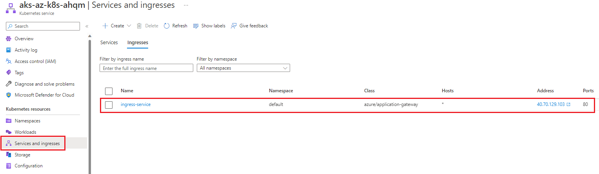

## Option \#1 Push-based CI/CD

This article outlines deploying with the push option as described in the [automated build and deploy for container applications article](XXX.md). To deploy the **Option \#1 Push-based CI/CD Architecture** scenario, follow the steps outlined [here](README.md) (if you haven't already), then perform the following steps:

1. Fork this repo to your GitHub: https://github.com/Azure/aks-baseline-automation. Note: Be sure to uncheck "Copy the main branch only".
2. Go to Actions on the forked repo and enable Workflows as shown: <https://github.com/YOURUSERNAME/aks-baseline-automation/actions>
   
3. Go to Settings on the forked repo and create a new environment
    1. Adding a new environment here: https://github.com/YOUR-REPO/settings/environments/new
    2. Click New Environment button: Environments / Add
    3. Name it prod
4. Set Azure subscription
    1. In Azure cloud shell run
       ```bash
       az account show *\#Shows current subscription*
       ```
       ```bash
       az account set --subscription "YOURAZURESUBSCRIPTION" *\#Set a subscription to be the current active subscription*
       ```
    2. Create a file called `ghToAzAuth.sh` in your bash working directory and copy the code block in this .md file into it: https://github.com/Azure/aks-baseline-automation/blob/main/docs/oidc-federated-credentials.md. You will need to update the following variable values:
       ```bash
       APPNAME=myApp
       RG=<AKS resource group name>
       GHORG=<your github org or user name>
       GHREPO=aks-baseline-automation
       GHBRANCH=main
       GHENV=prod
       ```
    3. Save the shell script after you have made the updates to those variables and run the script in your cloud shell
       ```bash
       bash ghToAzAuth.sh
       ```
       It will create the federated credentials *in* Azure *for* you. Navigate to Azure Portal \> Microsoft \| Overview \> Azure Active Directory \> App registrations \> YOURREGISTEREDAPPNAME \| Certificates & secrets
       You should have the following 3 Federated credentials similar to what is shown *in* the following screenshot:
       
       Next you need to create the Environment and GitHub Actions Repository secrets *in* your repo.
5. Create Actions secrets for your Azure subscription in your GitHub Repository *\#Reference: https://docs.microsoft.com/en-us/azure/developer/github/connect-from-azure?tabs=azure-portal%2Clinux\#use-the-azure-login-action-with-a-service-principal-secret*
    1. Navigate to Github Actions Secrets in your browser: From your repo select *Settings* > on the left plane select *Secrets* > select *Actions* in the dropdown
    2. Select *New repository secret* 
    3. Click *Add secret*
6. Review Environment secrets
    1. Navigate to environments in your browser: From your repo select *Settings* > on the left plane select *Environments* > select *New environment* at the top right corner of the resulting screen
    2. Enter a name for your environment then click *Configure environment*
    3. At the bottom of the resulting screen under Environment secrets click on *Add secret*
       ```bash
       # The values should be in the following format shown in these examples:
        AZURE_CLIENT_ID = 1gce4f22-5ca0-873c-54ac-b451d7f73e622
        AZURE_TENANT_ID: 43f977bf-83f1-41zs-91cg-2d3cd022ty43
        AZURE_SUBSCRIPTION_ID: C25c2f54-gg5a-567e-be90-11f5ca072277

       ```
       
    4. When *done* you should see the following secrets *in* your GitHub Settings:
       
7. Run the GitHub Actions workflow:
    1. Go to [https://github.com/YOUR REPO/aks-baseline-automation/actions](https://github.com/YOUR%20REPO/aks-baseline-automation/actions)
    2. Run the .github/workflows/App-flask-DockerBuild-Actions.yml workflow
    3. Enter the needed inputs:
       
    4. You will see the workflows start.
       
    5. When it completes both jobs will green showing the workflow was successful.
       
    6. You will be able to see the App was successfully deployed to the default namespace in your AKS cluster as shown in the following screenshots:
       
       
