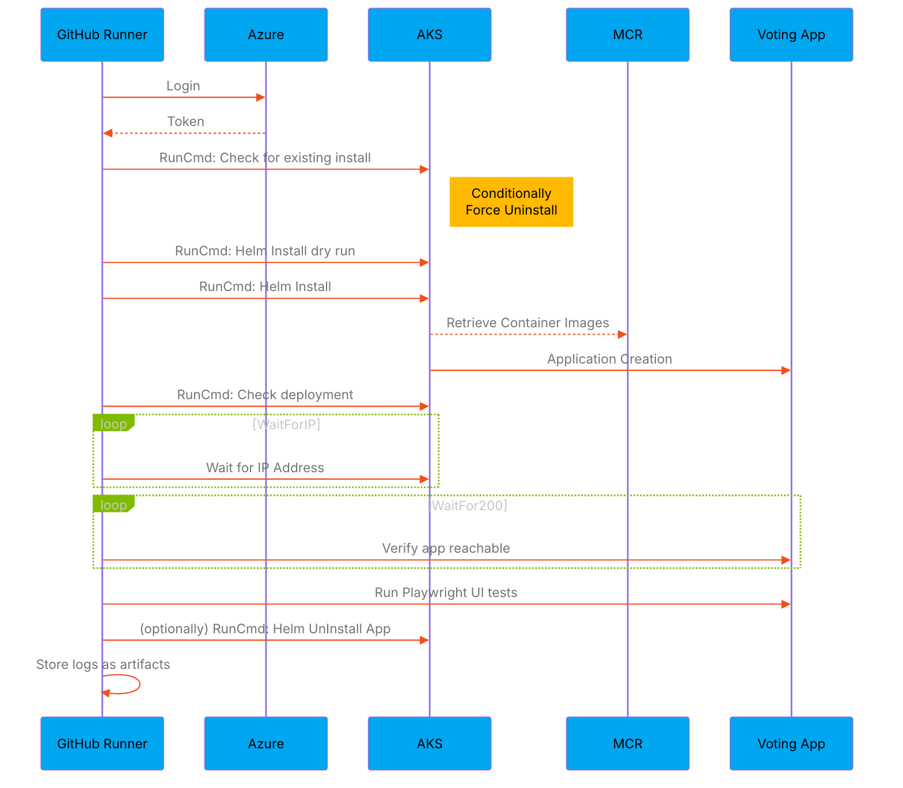

# Azure Vote - Helm Run Command Scenario

## Overview

This sample leverages the AKS Run Command ([aks command invoke](https://learn.microsoft.com/azure/aks/command-invoke)) and performs comprehensive validation steps to ensure the application has been deployed properly.

The application is the [AKS Voting App](https://github.com/Azure-Samples/azure-voting-app-redis), which is used in the [AKS Getting Started Guide](https://learn.microsoft.com/azure/aks/learn/quick-kubernetes-deploy-cli). It is a 2 container application that allows the user to use a Web UI to vote between Cats/Dogs, the votes are recorded in a Redis cache.

## Workflow steps



## Sample info

This sample is a GitHub Reusable Workflow, as an asset in a public repository it can be targeted directly or simply copied into your own repo.

The Azure Credentials required are that of OpenID Connect (OIDC) based Federated Identity Credentials, please see [here](/docs/oidc-federated-credentials.md) for more information.

The reusable workflow file is located [here](/.github/workflows/App-AzureVote-HelmRunCmd.yml). To call it from your own workflow, use the code snippet below or just run the workflow [App-Test-All.yml](/.github/workflows/App-Test-All.yml): 

```yaml
  #Here's how to call the reusable workflow from your workflow file
  deploy-azure-vote-app:
    uses: Azure/aks-baseline-automation/.github/workflows/App-AzureVote-HelmRunCmd.yml@main
    with:
      ENVIRONMENT: MyGitHubEnvironmentName
      RG: ResourceGroupToDeployTo
      AKSNAME: MyAksCluster
      APPNAME: azure-vote-public
      INGRESSTYPE: "PublicLoadBalancer"
    secrets:
      AZURE_CLIENT_ID: ${{ secrets.AZURE_CLIENT_ID }}
      AZURE_TENANT_ID: ${{ secrets.AZURE_TENANT_ID }}
      AZURE_SUBSCRIPTION_ID: ${{ secrets.AZURE_SUBSCRIPTION_ID }}
```

> This sample is directly leveraged in the [AKS Deployment Helper](https://github.com/Azure/Aks-Construction) for smoke-testing new Kubernetes clusters.

## Scenario Components

### Helm

[Helm](https://helm.sh/) is a package manager for Kubernetes, used to package and deploy applications with ease.
The Helm chart is written using [subcharts](https://helm.sh/docs/topics/charts/) for the deployments, whilst the parent Helm chart creates the Ingress and NetworkPolicy resources.

The helm charts are packaged as **AzureVote-helm.tgz** and placed under the .\workloads\azure-vote folder of this repo. For information about how to create the helm charts for this application, refer to [this article](https://learn.microsoft.com/azure/aks/quickstart-helm?tabs=azure-cli#create-your-helm-chart).

### AKS Run Command

The [AKS Run Command](https://learn.microsoft.com/azure/aks/command-invoke) allows you to remotely invoke commands in an AKS cluster through the AKS API. This can greatly assist with access to a private cluster when the client is not on the cluster private network while still retaining and enforcing full RBAC controls.

### Key Steps in the Action Workflow

#### Verifying

After creating the application, it can be useful to check that the application is serving content. Steps in this workflow wait for an IP address to be allocated, which is then tested to ensure content is returned.

#### Playwright

[Playwright](https://playwright.dev) is a web testing framework which is used to interact with a web application to mimic user input. Its use in this workflow is a [single test]((deploymentassets/misc/playwrighttests/azure-vote-catswin.spec.js)) to verify that communication between pods is successful by voting (calling redis) and asserting the vote balance is correct.
